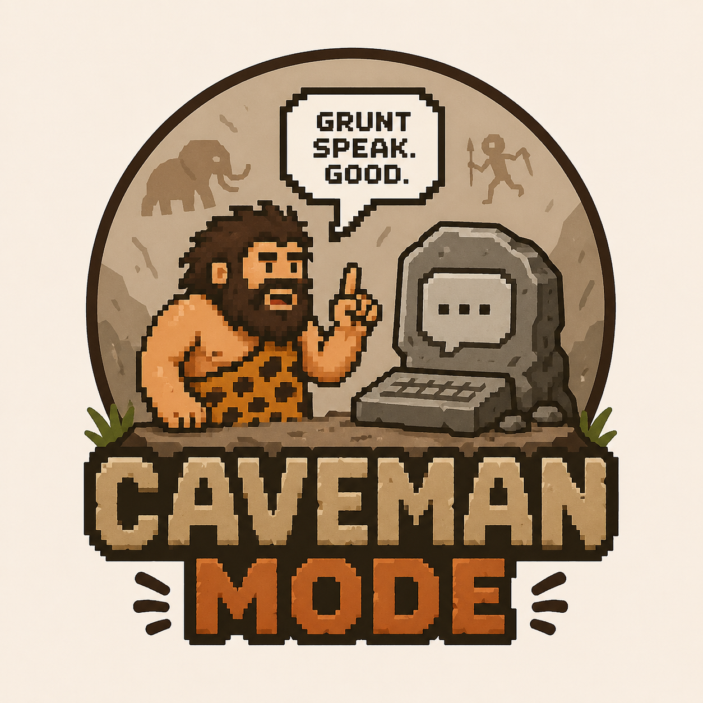

<div align="center">



# caveman

**Agent skill. Make AI talk like caveman.**

Short words. Short sentence. No fluff.

Works with [Claude Code](https://docs.anthropic.com/claude-code) and [OpenAI Codex](https://developers.openai.com/codex/skills) — same `SKILL.md`, three install paths.

</div>

---

## Install

### Claude Code — plugin (easiest)

```
/plugin marketplace add akramsystems/caveman
/plugin install caveman@akramsystems-plugins
```

### Claude Code — manual symlink

```bash
ln -s "$PWD/skills/mode" ~/.claude/skills/caveman
```

### OpenAI Codex

User-level (any project):

```bash
mkdir -p ~/.agents/skills
ln -s "$PWD/skills/mode" ~/.agents/skills/caveman
```

Repo-level (one project only) — run from inside that project:

```bash
mkdir -p .agents/skills
ln -s /path/to/caveman/skills/mode .agents/skills/caveman
```

## Use

### Claude Code

```
/caveman:mode
```

Or just say *"caveman mode"*. Say *"stop caveman"* to turn off.

### Codex

```
$caveman
```

Or pick it from `/skills`. Same trigger phrases work too — *"caveman mode"* on, *"stop caveman"* off.

## Repo layout

```
caveman/
├── .claude-plugin/
│   ├── plugin.json          ← Claude Code plugin manifest
│   └── marketplace.json     ← single-plugin marketplace manifest
├── skills/
│   └── mode/
│       └── SKILL.md         ← the skill itself
├── assets/
│   └── caveman.png
├── LICENSE
└── README.md
```

The same `SKILL.md` is what Claude Code and Codex both load — only the install path differs.

<div align="center">
<sub>grunt. speak. good.</sub>
</div>
